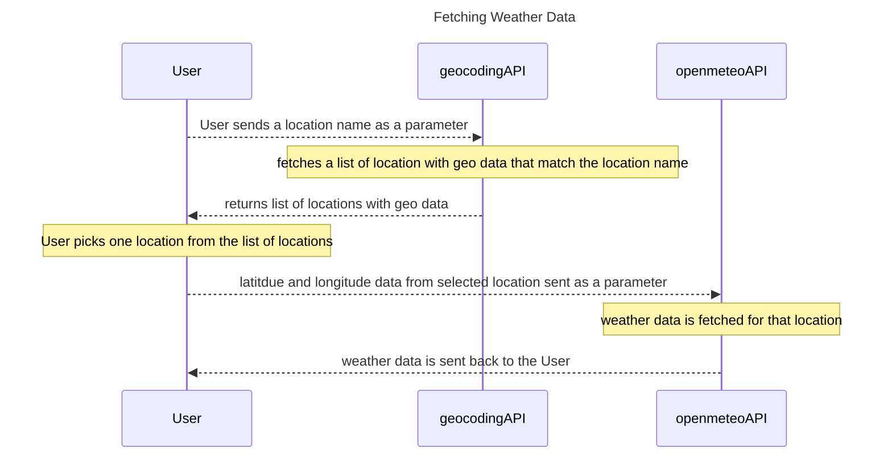
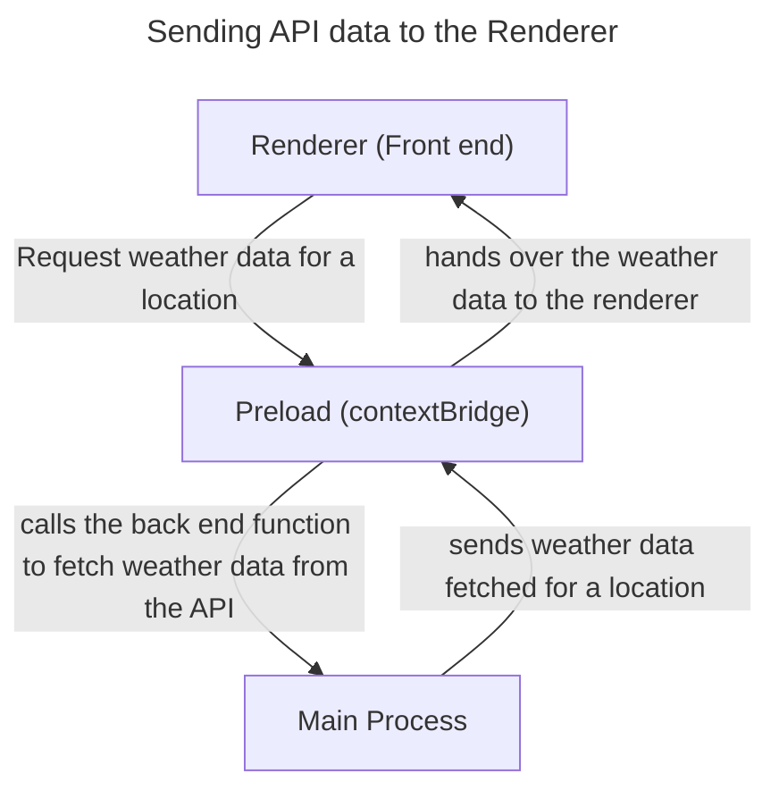
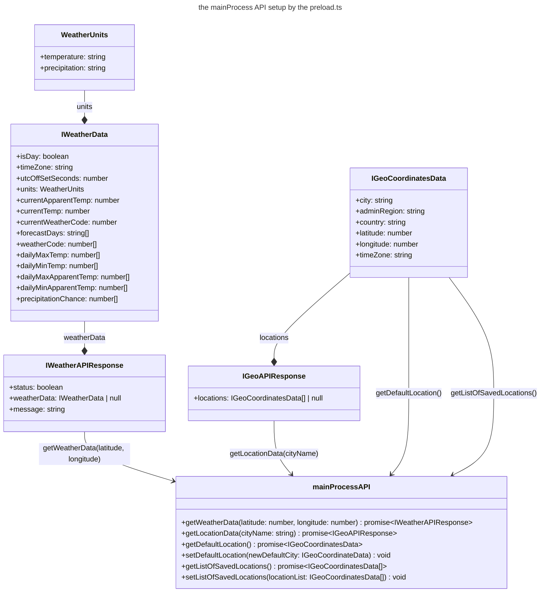
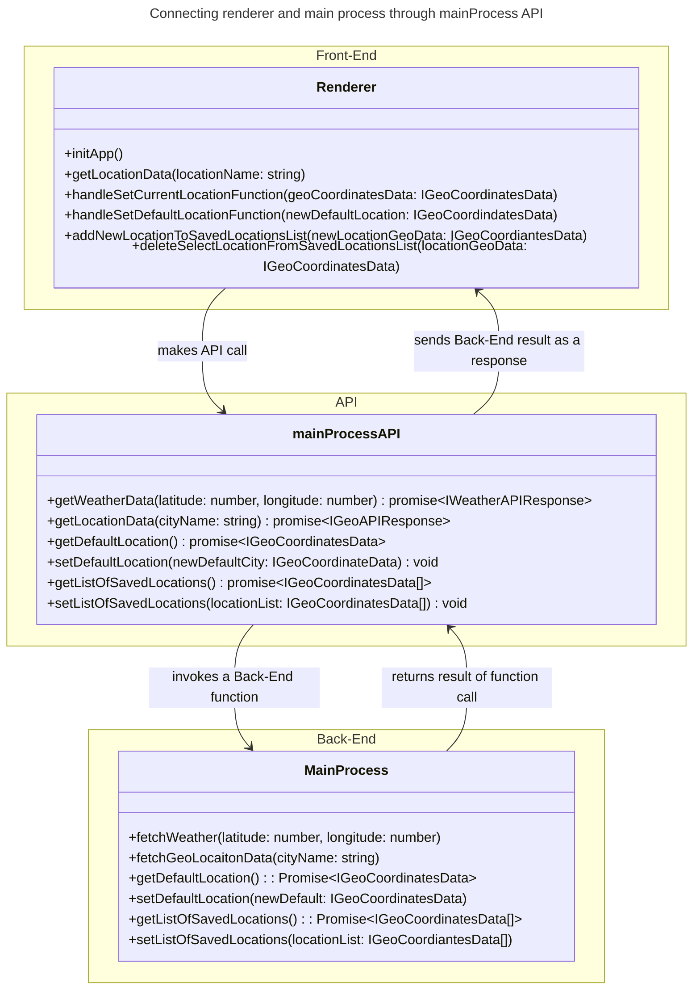
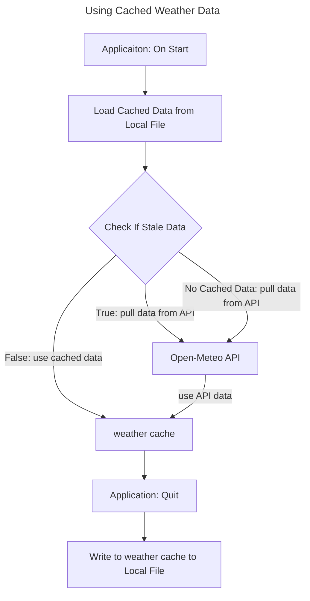
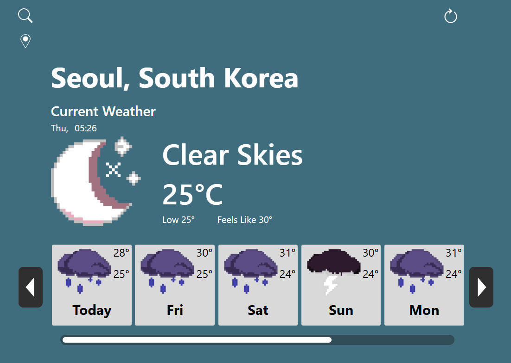
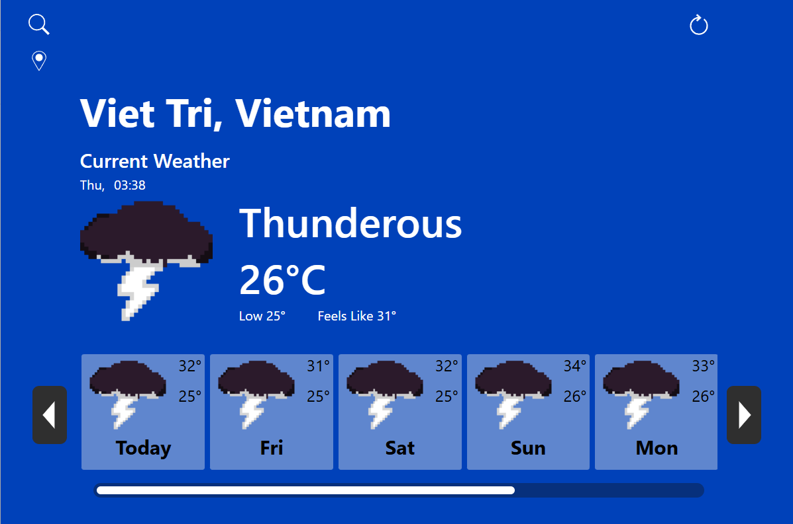
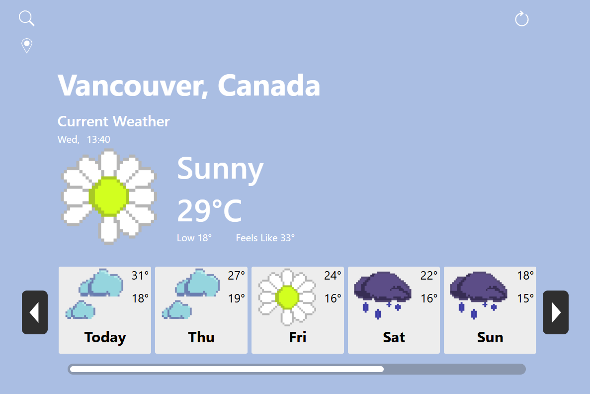

# Weather Horizon Weather App

## Table of Contents

- [About the project](#about-the-project)
    - [Tech Stack](#tech-stack)
    - [APIs](#apis)
- [Fetching weather data](#fetching-weather-data)
- [Caching weather data](#caching-weather-data)
- [Saving Locations to View Local weather](#saving-locations-to-view-local-weather)
- [Theming](#theming)
- [How to Run the project](#how-to-run-the-project)
    - [1. Grabbing the Project Files](#1-grabbing-the-project-files)
        - [Option A: Download the ZIP file](#option-a-download-the-zip-file)
        - [Option B: Clone with Git](#option-b-clone-with-git)
    - [2. Installing dependencies](#2-installing-dependencies)
    - [3. Setting up the .env file](#3-setting-up-the-env-file)
        - [Option A Setting up the .env file using Open-Meteo API and Open-Meteo Geocoding API](#option-a-setting-up-the-env-file-using-open-meteo-api-and-open-meteo-geocoding-api)
        - [Option B Setting up the .env file using a weather API and geocoding API of your choice](#option-b-setting-up-the-env-file-using-a-weather-api-and-geocoding-api-of-your-choice)
- [4. Run the project](#4-run-the-project)

## About the project

The goal for this project was to create a weather app combining web development technology (React.js, CSS, TypeScript) and bundling it with the Electron.js framework to create a desktop application. What differs this project compared to other weather app projects is the visual design of the application as a theme mechanic was implemented based on the current local weather based on the multiple music artists I follow and listen to.

### Tech Stack

- React.js
- Electron.js
- TypeScript


### APIs

- https://open-meteo.com/
- https://open-meteo.com/en/docs/geocoding-api

React.js was chosen to implement the front-end of the application due to its ease of use to create dynamic and responsive UIs rapidly, ability to create reusable UI components, and intuitive JSX syntax combining JavaScript and HTML.

Electron.js was chosen as the main framework to create a desktop application due to my familiarity with coding in JavaScript, along with the variety of options within web development for the front-end. In addition to that due to the nature of front-end libraries for web development being based on mark-up languages tracking and designing the hierarchy of the UI eases development overall.

TypeScript was chosen as the programming language of choice rather than JavaScript due to type checking being a feature to catch bugs during development, and its syntax similarity with other strictly typed C based programming languages.

<br>

## Fetching weather data

The API’s used for this project were the Open-Meteo and Open-Meteo geocoding API to retrieve weather data from different locations around the world. To view the local weather of a location the user sends a request to the geocoding API with the name of the location they want to view, with the resulting list returned from the request containing geographical data (county, latitude, longitude, time zone) of all the places that match the location’s name. From there when the user selects the correct location a request is sent to the Open-Meteo API using the latitude and longitude values of the selected location to retrieve the weather data for that area.



Implementing both the Geocoding API and the Open-Meteo API into the app involved using Electron’s Inter-Process Communication (IPC). The Inter-Process Communication allows the front-end render to access Node.js backend operations such as fetching API data handled exclusively by the main process (`index.ts`), which acts similar to a back end server. As the renderer operates under the same constraints as a web browser (inability to access to Node.js operations or handle secure API fetching), a `preload.ts` script was created to house the code for the IPC by use of the `contextBridge` API. This setup allows the front-end to connect with the main process and safely access Node.js backend operations.



The `preload.ts` script acts essentially as an API which the front-end renderer calls to get data, post data, or call functions handled by the backend.



<br>



The various functions in the front end handle user events and based on the user event the appropriate method in the mainProcessAPI is called and invokes the correct function in the back end to either send or receive data similar to `POST` and `GET` methods for a HTTP request.

<br>

## Caching weather data

To prevent the weather API call from being abused and reduce the number of times the weather API request can be made within a given time period, data caching was implemented to circumvent it. A map variable in the main process serves as the cache to store weather data. When a request for weather data is received the data from the Open-Meteo API is stored in the map using the location’s latitude and longitude as its key. For subsequent request of the same location or previously requested locations the cached data would be sent to the front-end rather than calling the external API. A timestamp marking when each location’s data was fetched to determine if new data should be fetched from the API or the cached data is used.

A map variable was used to serve as the cache since it stores values using key value pairs, it allows for fast retrieval of data. Because of this it scales to hold data for thousands of locations if the user were to request weather data from multiple different locations and toggle back and forth between previously searched locations to view them.

The cached weather data is also stored locally to a JSON file when the application quits. This feature was implemented as an edge case to prevent continual API calls to the Open-Meteo API if a user were to continually quit and re-open the application. It also serves to solve the problem of the in-memory map variable cache being wiped when the application closes. A timestamp is included in the cached data when it gets written to the JSON file to mark when the application was closed and is checked on start up; if the data is deemed stale, a fresh API call is made, else the cached data is served instead.

```json
{
	timeStamp: float,
	weatherDataCollection:{
		location:object,
		location: object,
		...
	}
}
```



<br>

## Saving Locations to View Local weather

A feature of this app is the ability to save multiple different locations to a favourites list, which allows for quick access to view the local weather of that area. The way this was implemented was by having the front-end (renderer process) update a list of locations in the back end (main process) through the mainProcess API when a user saves a new location or deletes a location from the favourites menu. On the front-end the `useState` hook is used to manage and track the list of saved locations which syncs with the list in the back end anytime there are changes.

During the shutdown process of the app the list of saved locations and currently set default location gets written to a JSON file that lives in the app data folder for the application using the following structure for each entry:

```json
{
  city: string,
  adminRegion: string,
  country: string,
  latitude: number,
  longitude: number,
  timeZone: string,
}
```

When the app starts up a `useState` hook in the front-end acts as a flag to track when the saved locations data is properly loaded from reading the JSON file before properly rendering the UI.

<br>

## Theming

The theme of the app changes based on the current local weather as a small fun feature added in with the weather icons and colour scheme being easter eggs based on the music artists I stan. The theming changes through dynamically applying CSS classes to HTML elements based on the weather.







<br>

## How to Run the project

### 1. Grabbing the Project Files

#### Option A: Download the ZIP file

1. Click on the code button in the repository
2. Select **Download ZIP**
3. Follow the procedures to extract the files on your computer

#### Option B: Clone with Git

1. Ensure you have git installed on your system and copy the url under HTTPS

    [https://github.com/ThomasNLy/weather_app_electron_react_test.git](https://github.com/ThomasNLy/weather_app_electron_react_test.git)

2. open up the terminal and navigate to the desired directory
3. run the following command in the terminal

    ```
    git clone https://github.com/ThomasNLy/weather_app_electron_react_test.git
    ```

### 2. Installing dependencies

1. navigate to the project directory and open the terminal in it
2. run the following command in the terminal to install all dependencies and npm packages required

    ```
    npm install
    ```

### 3. Setting up the .env file

To pull live weather data API keys need to be setup within a **.env** file within in the root directory (preferably from https://open-meteo.com/ as the structure of the code for the API call is configured to match the response formatting from it).

#### Option A Setting up the .env file using Open-Meteo API and Open-Meteo Geocoding API

1. create an **.env** file within the root directory of the project and add in the following lines with the `WEATHER_API` field and replacing `YOUR_WEATHER_API_KEY_HERE` with your API key/API URL(either the free tier one or the paid version). The same steps are to be done with the `GEO_API` field as well by replacing `YOUR_GEO_API_KEY_HERE`.

    ```
    WEATHER_API=YOUR_WEATHER_API_KEY_HERE
    WEATHER_API_LATITUDE_PARAMETER=latitude=
    WEATHER_API_LONGITUDE_PARAMETER=&longitude=
    WEATHER_API_FORECAST_PARAMETERS=&daily=weather_code,apparent_temperature_max,apparent_temperature_min,precipitation_probability_max,temperature_2m_max,temperature_2m_min&current=is_day,apparent_temperature,temperature_2m,weather_code&timezone=auto
    GEO_API=YOUR_GEO_API_KEY_HERE
    GEO_API_PARAMETERS=&count=5&language=en&format=json
    ```

#### Option B Setting up the .env file using a weather API and geocoding API of your choice

1. create an **.env** file within the root directory of the project and add in the following lines with the `WEATHER_API` field and replacing `YOUR_WEATHER_API_KEY_HERE` with your API key/API URL(either the free tier one or the paid version). The same steps are to be done with the `GEO_API` field as well by replacing `YOUR_GEO_API_KEY_HERE`. Ensure that the geocoding API is capable of return geo data with the name of a location passed as parameter.

    ```
    WEATHER_API=YOUR_WEATHER_API_KEY_HERE
    WEATHER_API_LATITUDE_PARAMETER=latitude=
    WEATHER_API_LONGITUDE_PARAMETER=&longitude=
    WEATHER_API_FORECAST_PARAMETERS=&daily=weather_code,apparent_temperature_max,apparent_temperature_min,precipitation_probability_max,temperature_2m_max,temperature_2m_min&current=is_day,apparent_temperature,temperature_2m,weather_code&timezone=auto
    GEO_API=YOUR_GEO_API_KEY_HERE
    GEO_API_PARAMETERS=&count=5&language=en&format=json
    ```

2. To configure the weather API parameters set the values for `WEATHER_API_LATITUDE_PARAMETER`, `WEATHER_API_LONGITUDE_PARAMETER` with the correct parameters that match the API of your choice. For the `WEATHER_API_FORECAST_PARAMETERS` field, set its value to match the API of your choice with the following parameters included:
    - weather code (for daily weather variables)
    - apparent max temperature (for daily weather variables)
    - apparent min temperature (for daily weather variables)
    - max precipitation probability (for daily weather variables)
    - max temperature (2m) (for daily weather variables)
    - min temperature (2m) (for daily weather variables)
    - is day (for current weather variables)
    - weather code (for current weather variables)
3. To configure the geo API field set the value for the `GEO_API_PARAMETERS` following the format for the geocoding API chosen to return a maximum result of **5 locations,** configured to English as the language, and in **JSON format.**
4. Within `index.ts` the `fetchWeather()` function and the `fetchGeoLocationData()` function has to be modified to match response received when fetching data from the respective APIs.
    1. Modifying `fetchWeather()` function

        Modify the `weatherData` variable declaration inside the function that represents an instance of an `IWeatherData` object by setting it’s object properties to the correct fields returned from the chosen API. In the example given below replace `APIRESPONSE_FIELD_HERE` with the correct field.

        ```tsx
        let weatherData: IWeatherData = {
            isDay: APIRESPONSE_FIELD_HERE,
            timeZone: APIRESPONSE_FIELD_HERE,
            utcOffSetSeconds: APIRESPONSE_FIELD_HERE,
            units: {
                temperature: APIRESPONSE_FIELD_HERE,
                precipitation: APIRESPONSE_FIELD_HERE,
            },
            currentApparentTemp: APIRESPONSE_FIELD_HERE,
            currentTemp: APIRESPONSE_FIELD_HERE,
            currentWeatherCode: APIRESPONSE_FIELD_HERE,
            forecastDays: APIRESPONSE_FIELD_HERE,
            weatherCode: APIRESPONSE_FIELD_HERE,
            dailyMaxTemp: APIRESPONSE_FIELD_HERE,
            dailyMinTemp: APIRESPONSE_FIELD_HERE,
            dailyMaxApparentTemp: APIRESPONSE_FIELD_HERE,
            dailyMinApparentTemp: APIRESPONSE_FIELD_HERE,
            precipitationChance: APIRESPONSE_FIELD_HERE,
        };
        ```

    2. Modifying `fetchGeoLocationData()`

        Modify the `locationData` variable declaration inside the function that represents an instance of an `IGeoCoordinatesData` object by setting its object properties to the correct fields returned from the chosen API. In the example given below replace `APIRESPONSE_FIELD_HERE` with the correct field.

        ```tsx
        let locationData: IGeoCoordinatesData = {
            city: APIRESPONSE_FIELD_HERE,
            adminRegion: APIRESPONSE_FIELD_HERE,
            country: APIRESPONSE_FIELD_HERE,
            longitude: APIRESPONSE_FIELD_HERE,
            latitude: APIRESPONSE_FIELD_HERE,
            timeZone: APIRESPONSE_FIELD_HERE,
        };
        ```

### 4. Run the project

1. open the project directory with VS Code
2. open a new terminal within the IDE and enter the following command to run it

    ```
    npm start
    ```
